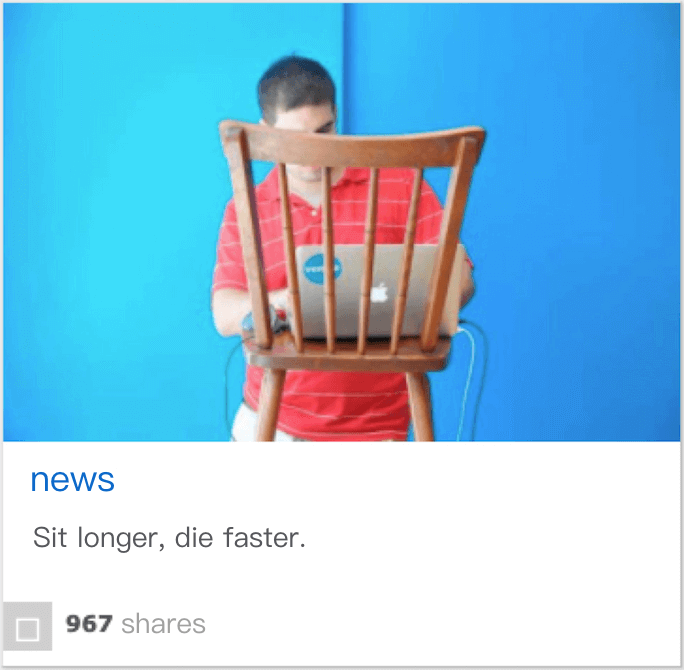

# Move your ass or die faster

[简体中文](./README.md) | English

In order to remind you not to sit for a long time, this program generates a warning picture with the number of sharing in the afternoon of each working day.

Inspired by an internet picture. :)

<p align="center">
  
</p>

## Usage

1. create a script

```sh
cd <home_dir>
touch ass-reminder.sh
chmod +x ass-reminder.sh
```

2. edit the script

```sh
cd <project_dir>
npm run start
```

3. add a crontab job

```sh
# crontab -e
# run at 15:45 every day
45 15 * * * <home_dir>/ass-reminder.sh
```
